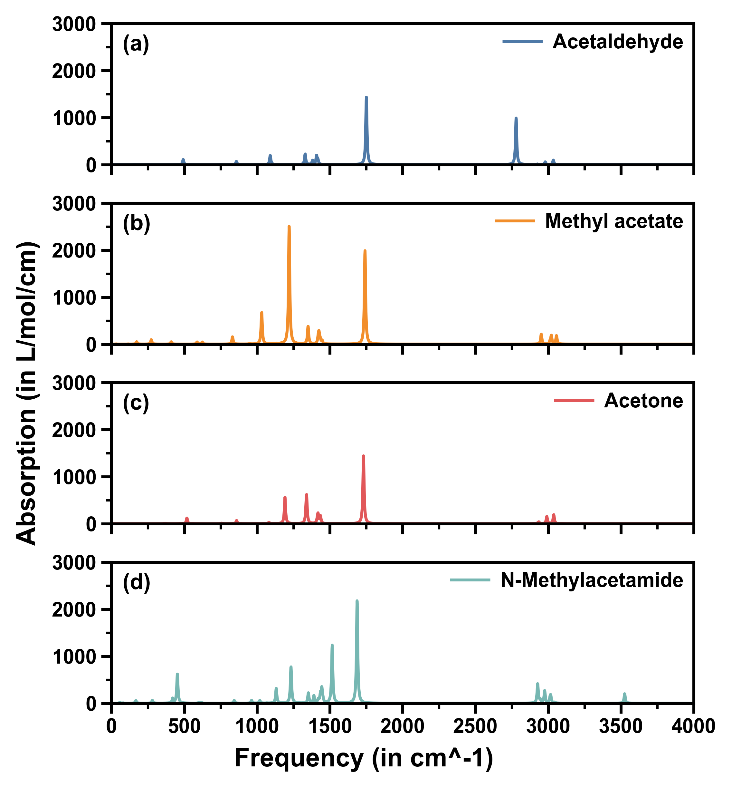
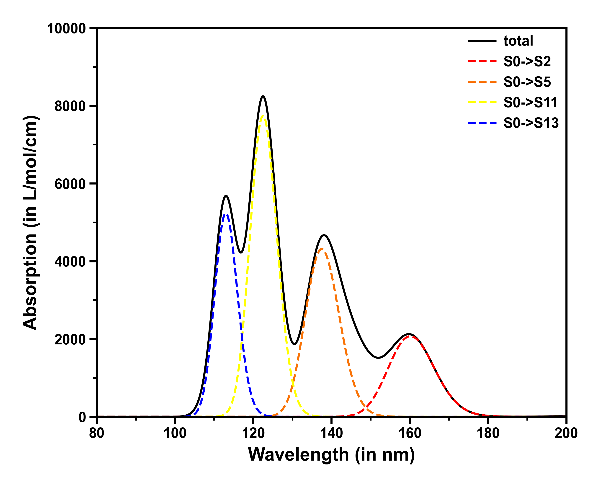

<h1 align="center">
    
</h1><br>


KimariDraw 是一款开源的 Python 脚本，旨在绘制各种光谱图形，特别适用于处理著名的波函数分析程序 Multiwfn  生成的光谱数据。它能够将 Multiwfn 生成的数据以美观、清晰的方式重新绘制成单曲线单子图、多曲线单子图、单曲线多子图以及多曲线多子图。

当你使用 KimariDraw 时，你可以享受到以下的功能：

- **支持多种光谱类型**：KimariDraw 支持使用 Multiwfn 绘制 NMR、IR 等光谱导出的数据，即 Multiwfn 生成的文本文件。

- **支持多子图绘制**：KimariDraw 不仅支持一单子图的绘制，同时也支持多子图的绘制。

- **支持多种文件格式**：KimariDraw 支持将图片导出为多种文件格式，如 PNG、JPG、PDF、SVG 等。

- **易于安装和配置**：KimariDraw 的安装和配置十分简单，您只需要按照项目 README 文件中的说明进行操作即可。

- **自定义功能强大**：KimariDraw 可以根据需要自定义曲线的颜色、图例以及格式，可以达到科研论文要求。

Multiwfn 是一个非常强大的波函数分析程序。Multiwfn 免费、开源、高效、灵活，它支持几乎所有最重要的波函数分析方法。目前，Multiwfn 是量子化学领域的常用工具之一，得到了广泛的应用和认可。

**如果您对 Multiwfn 还不熟悉，请访问 [Multiwfn 官网](http://sobereva.com/multiwfn/)了解更多信息。**

## 安装

### 常规安装

1. 首先，安装 Python 环境和 pip 包管理工具。如果您还没有安装它们，请先安装它们。并确保 Python 版本为 3.8 版本，如果和开发的版本不符，有可能无法运行 KimariDraw。

```shell
python==3.8.13
```

2. 下载 KimariDraw 源代码：

```shell
git clone https://github.com/kimariyb/kimariDraw.git
```

3. 进入 KimariDraw 目录并安装依赖：

```shell
cd kimariDraw
pip install -r requirements.txt
```
这将自动安装 KimariDraw 所需的 pandas、matplotlib 和 proplot 等依赖项。请注意，如果您已经安装了这些依赖项，则可以跳过此步骤。如果由于网速问题，下载过慢，可以尝试使用国内源安装依赖。

```shell
pip install -r requirements.txt -i https://pypi.tuna.tsinghua.edu.cn/simple
```


### 虚拟环境安装

**推荐！** 我们推荐使用 anaconda 虚拟环境进行安装，方便对包进行管理，同时也不会影响其他项目的环境。

1. 如果没有安装 Python，可以不用安装 Python，直接前往 [anaconda 官网](https://www.anaconda.com/)下载 anaconda 最新版本。安装并配置好以后，使用 anaconda 新建一个环境。

```shell
conda create -n kimaridraw python=3.8.13
```

2. 激活名为 kimaridraw 的 conda 环境：

```shell
conda activate kimaridraw
```

3. 下载 KimariDraw 源代码：

```shell
git clone https://github.com/kimariyb/kimariDraw.git
```

4. 进入 KimariDraw 目录并安装依赖：

```shell
cd kimariDraw
pip install -r requirements.txt
```

这将自动安装 KimariDraw 所需的 pandas、matplotlib 和 proplot 等依赖项。同时，由于激活的 conda 环境，因此 pip 安装的包只会在 kimaridraw 环境下使用，如果不激活就不会被使用。这样就很好的避免了不同任务依赖的环境不同，所导致的版本冲突。

## 使用

在使用 KimariDraw 之前，必须使用 Multiwfn 自行根据量子化学计算程序生产的各种光谱计算产生的 `.out` 文件得到光谱的数据。如果不了解如何使用 Multiwfn 绘制各类光谱，可以浏览 Sob 的 [使用Multiwfn绘制红外、拉曼、UV-Vis、ECD、VCD和ROA光谱图](http://sobereva.com/224)。

**请注意：在正式运行前，请确保已经安装了 KimariDraw 所需要的模块和包，以免程序报错！**

### 直接通过命令行进入主程序

KimariDraw 可以直接使用命令行进入主程序：

```shell
python kimaridraw.py
```

进入主程序后会显示一些版本信息以及其他的一些信息。同时问你是否使用默认的 `settings.toml` 文件，如果选择 y 则会在当前文件夹下寻找这个文件，如果选 n 则需要手动输入一个 toml 文件。toml 文件是用来记录配置文件信息的，详情请浏览 **配置** 一节。

```shell
KimariDraw --  A Python script that processes Multiwfn spectral data and plots various spectra.
Version: v2.4.0, release date: Aug-6-2023
Developer: Kimariyb, Ryan Hsiun
Address: XiaMen University, School of Electronic Science and Engineering
KimariDraw home website: https://github.com/kimariyb/kimariDraw

Copyright © 2023 Kimariyb. All rights reserved.
Currently timeline: Aug-07-2023, 00:45:57

Do you want to use the default settings.toml configuration file? (y/n):
```

接着程序要求输入记录光谱数据的文本文件，输入后进入如下页面。如果开启多子图模式，则必须提供一个 `multiple.txt`。

```shell
======= Main function page =======
1. Change the dpi of image. now dpi is: 500
2. Change the format of image. now format is: png
3. Plot and save the image now!
Please select the operation to be performed (enter the corresponding number):
```

在这个页面可以选择更改保存图片的 dpi、格式。选择完毕后，最后可以选择 3 保存图片。保存后会在当前文件夹下生成 figure.png 文件，如果这个文件已经存在，则生成 figure1.png、figure2.png 以此类推。

### 直接通过命令行命令执行

KimariDraw 除了可以直接调用主程序以外，还可以通过命令行命令执行，这样就很方便使用脚本进行批处理。KimariDraw 支持的参数可以通过 `python kimaridraw.py -h` 查看。

```shell
usage: KimariDraw [--help] [--set SET] [--dpi DPI] [--format FORMAT] [--version]
                  input

KimariDraw -- A Python script that processes Multiwfn spectral data and plots
various spectra.

positional arguments:
  input                 Text file containing spectral data generated by Multiwfn

optional arguments:
  --help, -h            Show this help message and exit
  --set SET, -s SET     The toml file to record the setting information, the
                        default is settings.toml in the current directory
  --dpi DPI, -d DPI     The dpi of the output graph, the default is 500
  --format FORMAT, -f FORMAT
                        The image format of the output file, the default is png
  --version, -v         Show the version information
```

如果在命令行里直接输入 `python kimaridraw.py multiple.txt` 则不会进入主程序，会直接根据参数和配置文件生成相对应的图片。


## 配置

使用 KimariDraw 需要提供一个 toml 文件用来配置绘图的效果。可以将其命名为为 `settings.toml`，这样就不需要手动选择读取的配置文件。下面是一个绘制多子图红外光谱的 `settings.toml`。

```toml
# 光谱绘制的类型，可选 1. 单子图；2. 多子图。
# 如果需要绘制多子图，则需要先修改 PlotType，再将包含多子图的数据的 txt 文件文件名写在一个名为 multiple.txt 的文件中
PlotType = 2
# X 轴坐标的最小、最大值以及间距，例如 0, 4000, 500
xLimit = [0, 4000, 500]
# Y 轴坐标的最小、最大值以及间距，例如 0, 3000, 1000
yLimit = [0, 3000, 1000]
# 配图的标题，可以为空
Title = ""
# 设置 x 轴标签
xLabel = "Frequency (in cm^-1)"
# 设置 y 轴标签
yLabel = "Absorption (in L/mol/cm)"
# 设置全局的字体，一般为 Arial
FontFamily = "Arial"
# 设置图片的大小，也就是设置图片的长和宽。就算开启绘制多子图模式，也代表的是总的大小，不是子图的大小。
# 绘制多子图时，可以先想好每一个子图的大小，然后分别乘上行数和列数。必须为相同数据类型！
FigureSize = [4.5, 4.8]
# 曲线的颜色，可以为一个列表，优先从第一个开始选择。如果为空，则为默认的 color cycle。
# 如果开启了多子图，则每一个颜色就对应一个子图曲线的颜色。
Colors = ["black", "red", "orange", "blue"]
# 曲线的样式，可以为一个列表，优先从第一个开始选择
# 如果开启了多子图，则每一个格式就对应一个子图的格式
LineStyle = ["-", "-", "-", "-"]
# 是否显示表达式为 Y = 0 的直线，可选 0. 关闭；1. 开启
# 可以在绘制 ECD、VCD 谱时开启
ZeroLine = 0
# 选择是否显示子图的序号，只能在左上角。可选 0. 关闭；1. 开启
# 需要开启多子图才能配置
Serial = 1
# 是否显示图例，可选 0. 关闭；1. 开启
# 通常是绘制单子图的多曲线图时开启，多子图也可以开启。单开启时显示在图像的右上角。
Legend = 1
# 图例的文本，需要和 Colors 和 LineStyle 列表中元素的数量一样
LegendText = ["Acetaldehyde", "Methyl acetate", "Acetone", "N-Methylacetamide"]
# 多子图的排版，例如，[2, 2] 为 2 行 2 列的排列。推荐奇数使用 [n, 1]，偶数使用 [n/2, n/2]
# 仅开启多子图才能生效
SupType = [4, 1]
```

配置文件和数据文件都在 `example/IR` 文件夹下，下面是绘制效果：




## 绘制效果

### 绘制单子图

KimariDraw 可以很方便的绘制单子图，包括单曲线图和多曲线图。下面是绘制的效果，配置文件和数据都在 `example/ECD` 和 `example/UV-VIS` 文件夹下。

<table>
    <tr>
    <td></td>
    <td></td>
    </tr>
</table>

### 绘制多子图

KimariDraw 除了绘制单子图以外，还可以支持绘制多子图。并且也同时支持绘制多曲线图的多子图。如果想要绘制多子图，首先必须将 toml 文件中的 `PlotType` 属性修改为 2，接着在当前文件夹下新建一个 `multiple.txt` 的文件。然后将需要绘制的子图的路径写在 txt 文件中，如下所示。

```text
curve.txt
curve.txt
curve.txt
curve.txt
curve.txt
curve.txt
curve.txt
curve.txt
curve.txt
```

这个 `multiple.txt` 文件中内容所表示的意思是，绘制 9 个一模一样的子图，绘制的效果如下所示。 下面是绘制的效果，配置文件和数据文件都在 `example/UV-VIS` 文件夹下。


### 使用脚本批量产生光谱数据

KimariDraw 程序中自带了一个用来批量产生 Multiwfn 光谱数据的脚本。如果想要批量产生绘制光谱的数据，可以在 `script` 文件夹中找到这个脚本。其中 `GenData.sh` 为 Linux 系统下的脚本，`GenData.bat` 为 Windows 系统下的脚本。

`GenData.sh` 以及 `GenData.bat` 都需要一个名为 `commands.txt` 的文件。`commands.txt` 文件包含了执行 Multiwfn 生成数据所需要的命令，如果想要使用这个脚本，则必须对 Multiwfn 有一定的了解。


## 鸣谢

在开发 KimariDraw 时，主要使用了以下 Python 开源模组，在这里对开发这些模组的工作人员表示感谢。

- **matplotlib**
- **pandas**
- **proplot**
- **toml**


## 许可证

KimariDraw 基于 MIT 许可证开源。这意味着您可以自由地使用、修改和分发代码。有关更多信息，请参见 LICENSE 文件。

