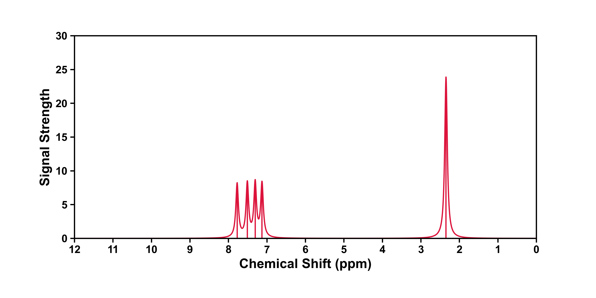

<h1 align="center">
    
</h1><br>


KimariDraw 是一款基于 Python 开发的开源绘图软件，主要用来处理著名波函数分析程序 [Multiwfn](http://sobereva.com/multiwfn/) 绘制光谱产生的数据，并依据这些数据重新绘制相对美观的各种光谱图。有关 Multiwfn 的

KimariDraw 目前支持使用 Multiwfn 绘制 NMR、IR 等光谱导出的曲线数据，即 Multiwfn 生成的文本文件，也支持 Excel 文件（必须安装约定进行配置）。KimariDraw 可支持修改图片大小、保存格式、曲线颜色等功能。

## 安装

本项目已经开源在 Github 上，您可以通过以下步骤安装 KimariDraw：

1. 首先，您需要确保已经安装了 Python 环境和 pip 包管理工具。如果您还没有安装它们，请先安装它们。

2. 下载 KimariDraw 源代码：

```shell
git clone https://github.com/kimariyb/kimariDraw.git
```

3. 进入 KimariDraw 目录并安装依赖：

```shell
cd kimariPlot
pip install -r requirements.txt
```
这将自动安装 KimariDraw 所需的 numpy、matplotlib 和 scipy 等依赖项。请注意，如果您已经安装了这些依赖项，则可以跳过此步骤。

## 使用

要使用 KimariDraw，请执行以下步骤：

**请注意：在正式运行前，请确保已经安装了 Python 和 pip 包管理工具，以免程序报错！**

1. 在命令行中导航到 KimariDraw 目录。

2. 运行 main.py：

```shell
python main.py
```

3. 输入 Multiwfn 输出的文本文件 `.txt` 或 Excel 文件 `.xlsx` 的路径。例如本项目中的 `data\NMR_curvewei.txt` 文件。

```shell
data/NMR_curvewei.txt
```

4. 选择 `1. NMR`，绘制 NMR 谱。



## 鸣谢

在开发 KimariDraw 时，主要使用了以下 Python 开源模组，在这里对开发这些模组的工作人员表示感谢。

- **numpy**
- **pandas**
- **matplotlib**
- **openpyxl**
- **scipy**

同时也感谢 Multiwfn 和其开发者卢天老师，为众多计算化学玩家带来这样一款，实用、轻便、功能强大的波函数分析软件。

## 许可证

KimariDraw 基于 MIT 许可证开源。这意味着您可以自由地使用、修改和分发代码。有关更多信息，请参见 LICENSE 文件。


