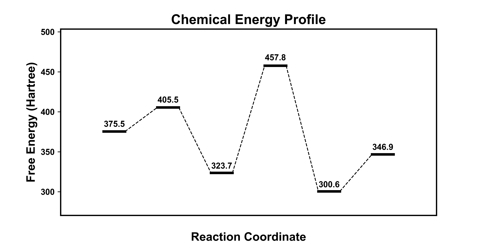
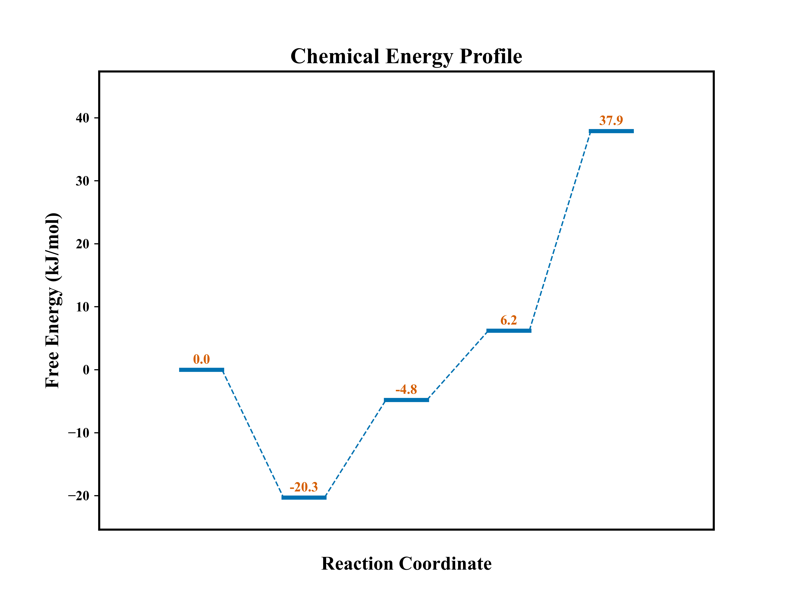
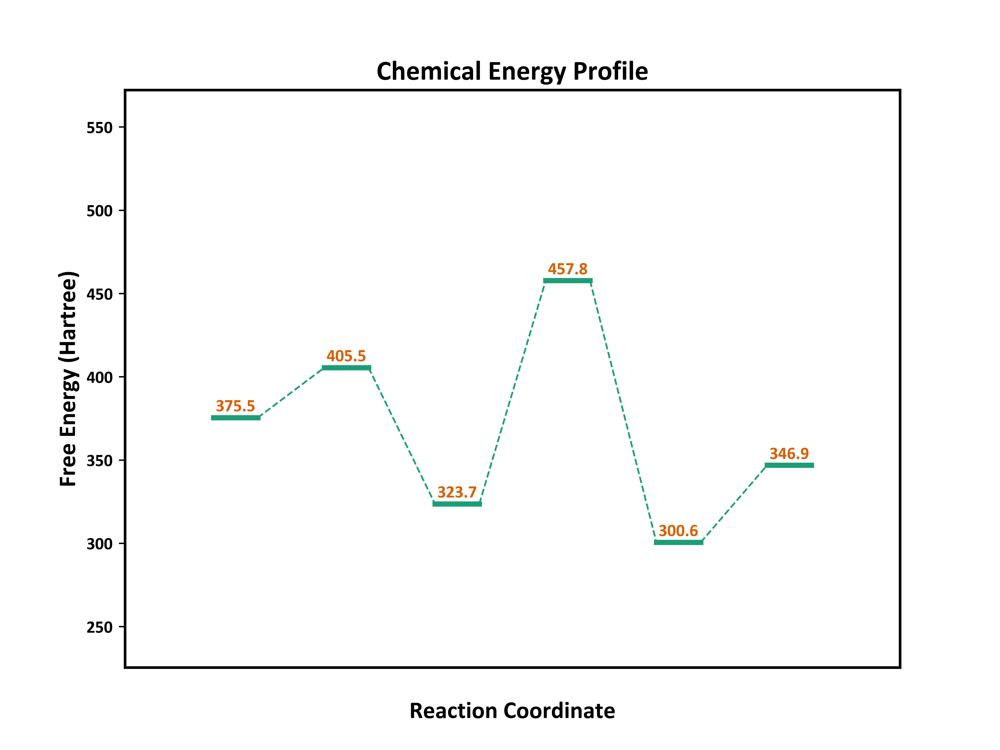
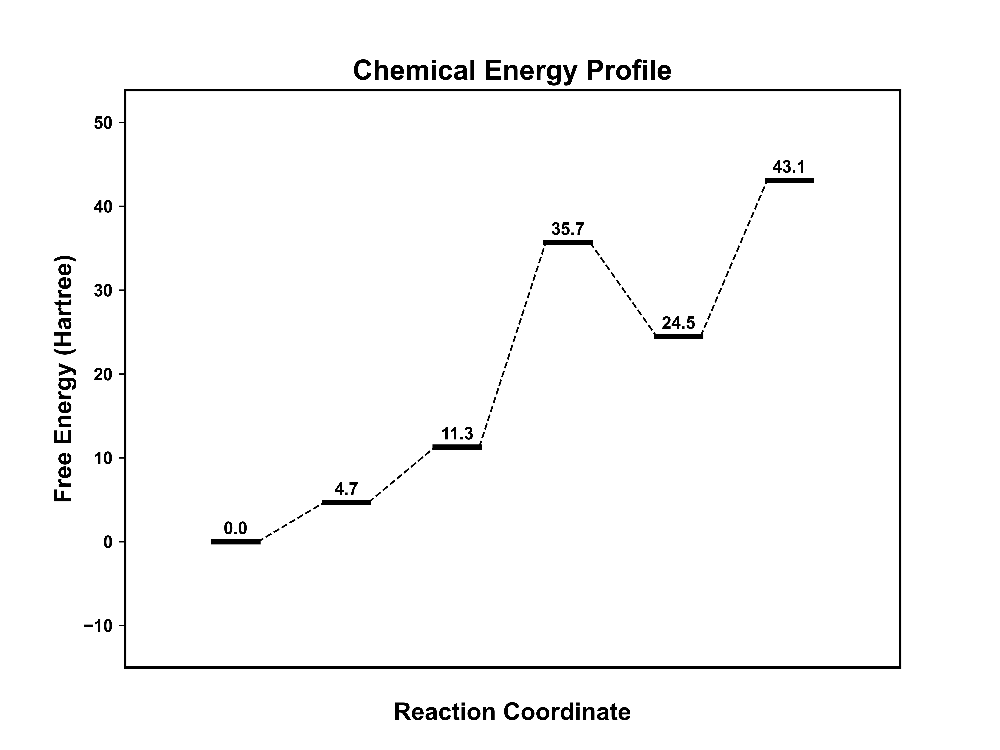

<div align="center">
    
</div>

---

kimariDraw 是一个用于绘制化学反应能量折线图的 Python 命令行程序，使用 Matplotlib 和 Numpy 库实现绘图功能。其目的是为了更方便的绘制出化学反应能量折线图，特别是在每周的组会上，需要你绘制化学反应能量折线图的时候，kimariDraw 能快速的帮你制作出化学反应能量折线图。

## 安装

你可以通过以下命令使用 pip 安装 kimariDraw，除此之外还需要确保已经安装了 Matplotlib 和 Numpy。

```bash
pip install kimariDraw
pip install Numpy
pip install Matplotlib
```

除此之外，还可以直接从 Github 上 clone（不推荐，因为这样得到的是源码）。

```bash
git clone https://github.com/kimariyb/kimariDraw.git
```

## 使用

使用 kimariDraw 绘制折线图需要一个 .kd 格式的文件。该文件应包含绘制折线图所需的数据和参数。以下是一个 .kd 文件的示例：

```basic
# UNIT = Hartree
# FIGURE_SIZE = 8, 4
# COLOR_THEME = science
# FONT_FAMILY = Arial
# PLOT_STYLE = line

BEGIN
1, 375.5
2, 405.5
3, 323.7
4, 457.8
5, 300.6
6, 346.9
END
```

在示例中，以 `#` 开头的是文件的文件头，其包含了单位、画布的大小、颜色以及字体等参数，以 `=` 分隔。`BEGIN` 和 `END` 之间表示的数据行，数据行每行包含两个数，用逗号分隔，分别表示反应进度和能量。反应进度必须从 1 开始。注意，文件头和数据行的中间必须存在一个空格。

- `UNIT:` 能量单位，例如 kJ/mol
- `FIGURE_SIZE:` 画布大小，例如 8,6
- `COLOR_THEME:` 颜色主题，例如 nature，不支持自定义颜色。可选择内置颜色主题，分别为 nature、science 和 normal
- `FONT_FAMILY:` 坐标字体，例如 Times New Roman，只能使用系统已经安装过的字体
- `PLOT_STYLE:` 绘制样式，例如 想要绘制折线图，则写上 line，暂不支持其他样式

使用 kimariDraw 绘制折线图的命令如下：

```bash
kimariDraw <filename>
```

其中 `<filename>` 是一个 `.kd` 格式的文件。

假如要运行 example 目录下的 `test2.kd` 文件，并且生成 `test.png` 则可以输入以下指令：

```bash
kimariDraw ./example/test2.kd -s test
```

则可以在当前目录下得到 test.png:



目前仅支持三种内置的颜色主题。







## 支持的参数

kimariDraw 支持以下命令行参数：

- `-s`, `--save_name`：指定输出文件名，默认为 figure.png

## 作者

**kimariDraw 是由 kimariyb 开发的。**

## 许可证

kimariDraw 使用 MIT 许可证。详细信息请参考 LICENSE 文件。