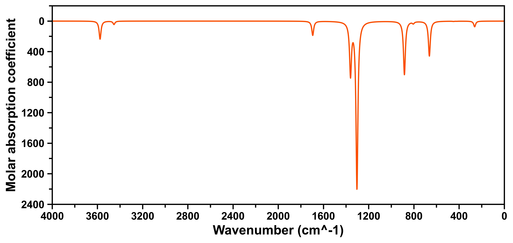
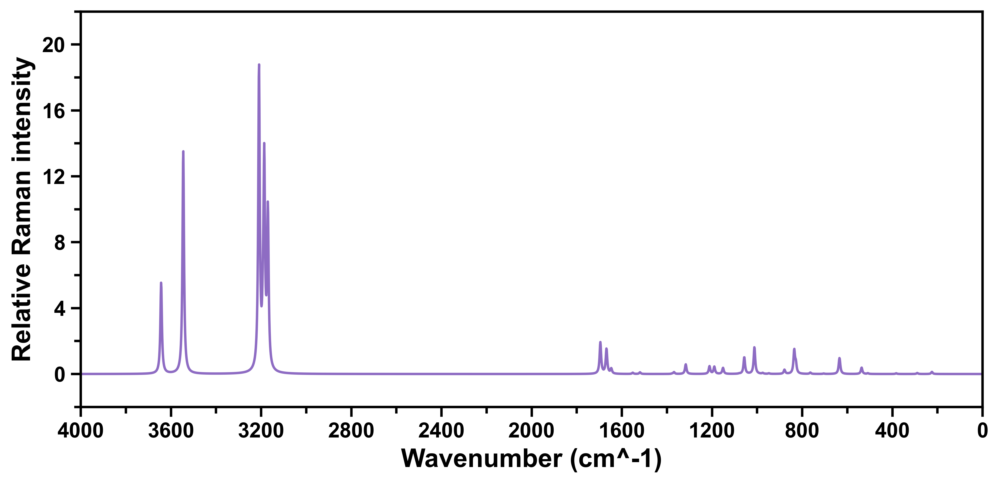
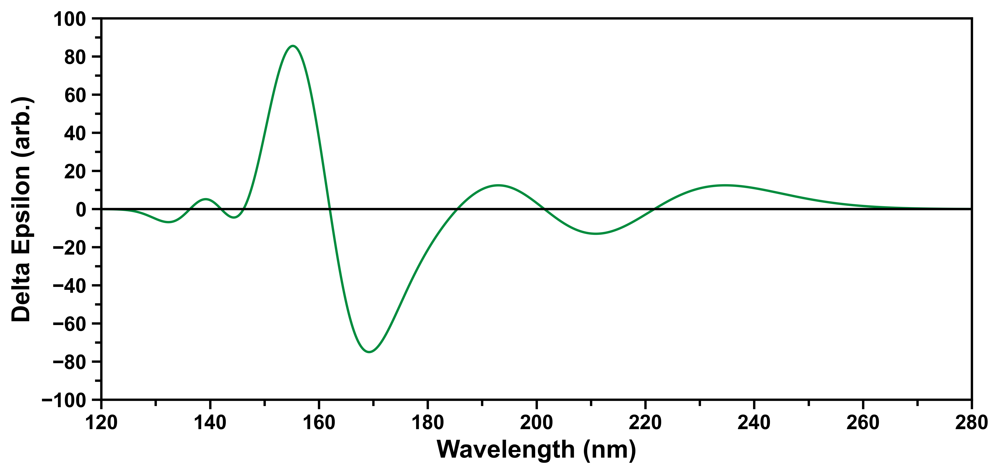

<h1 align="center">
    
</h1><br>


KimariDraw 是一款基于 Python 开发的开源绘图软件，专门用来处理著名的波函数分析程序 Multiwfn 绘制光谱所产生的数据，并重新绘制出美观、清晰的各种光谱图。对于科学研究人员和化学爱好者而言，KimariDraw 是一个非常实用的工具，它可以帮助用户更好地展示和分析波函数分析数据，有助于更好地理解和解释分析结果。

Multiwfn 是一个非常强大的波函数分析程序。Multiwfn 免费、开源、高效、灵活，它支持几乎所有最重要的波函数分析方法。Multiwfn 已经成为了量子化学领域的常用工具之一，目前得到了广泛的应用和认可。

**如果您对 Multiwfn 还不熟悉，请访问 [Multiwfn 官网](http://sobereva.com/multiwfn/)了解更多信息。**

当你使用 KimariDraw 时，你可以享受到以下的功能：

- **支持多种光谱类型**：KimariDraw 目前支持使用 Multiwfn 绘制 NMR、IR 等光谱导出的曲线数据，即 Multiwfn 生成的文本文件，也支持 Excel 文件（必须安装约定进行配置）。

- **美观的图形界面**：KimariDraw 的图形用户界面易于使用，您可以轻松地调整图表的大小、颜色等，以便更好地呈现您的数据。

- **支持多种文件格式**：KimariDraw 支持导入多种数据文件格式，包括文本文件和 Excel 文件。除此之外，KimariDraw 也支持将图表导出为多种文件格式，如 PNG、JPG、PDF 等。

- **易于安装和配置**：KimariDraw 的安装和配置十分简单，您只需要按照项目 README 文件中的说明进行操作即可。

## 安装

本项目已经开源在 Github 上，您可以通过以下步骤安装 KimariDraw：

1. 首先，您需要确保已经安装了 Python 环境和 pip 包管理工具。如果您还没有安装它们，请先安装它们。

2. 下载 KimariDraw 源代码：

```shell
git clone https://github.com/kimariyb/kimariDraw.git
```

3. 进入 KimariDraw 目录并安装依赖：

```shell
cd kimariDraw
pip install -r requirements.txt
```
这将自动安装 KimariDraw 所需的 numpy、matplotlib 和 scipy 等依赖项。请注意，如果您已经安装了这些依赖项，则可以跳过此步骤。

## 使用

在使用 KimariDraw 之前，必须使用 Multiwfn 自行根据量子化学计算程序生产的各种光谱计算产生的 `.out` 文件得到光谱的数据。如果不了解如何使用 Multiwfn 绘制各类光谱，可以浏览 Sob 的 [使用Multiwfn绘制红外、拉曼、UV-Vis、ECD、VCD和ROA光谱图](http://sobereva.com/224)。

要使用 KimariDraw，请执行以下步骤：

**请注意：在正式运行前，请确保已经安装了 Python 和 pip 包管理工具，以免程序报错！**

1. 在命令行中导航到 KimariDraw 目录。

2. 运行 main.py 进入 KimariDraw 主程序：

```shell
python main.py

KimariDraw -- A spectrum plotting program based on Multitwfn.
Version 2.0, release date: 2023-07
Developer: Kimariyb (XiaMen University, School of Electronic Science and Engineering)
KimariDraw Github website: https://github.com/kimariyb/kimariDraw

( Current date: 2023-07-16  Time: 15:53:43 )

Input file path, for example d:\project\kimariDraw\data\NMR_curve.txt
( Supported: .txt file and .xlsx file )

Please enter the file path: 
```


3. 输入 Multiwfn 输出的文本文件 `.txt` 或 Excel 文件 `.xlsx` 的路径。例如本项目中的 `data\NMR_curve.txt` 文件。

```shell
data/NMR_curvewei.txt
```

4. 选择想要绘制的谱，例如选择 `1. NMR`，就可以绘制 NMR 谱，如果不想绘制 NMR 则可以选择其他选项。

```shell
Please enter the spectrum you want to plot.
0. Return the main view
1. NMR
2. IR
3. Raman
4. UV-Vis
5. ECD
6. VCD
7. PES
```

5. 选择之后，会提示是否保存为图像，保存的格式在 `settings.ini` 中配置，保存在当前项目的 `output` 文件夹中，请确保 `output` 文件夹存在。

## 配置

KimariDraw 通过项目目录下的 `settings.ini` 修改光谱的样式，默认的配置参数如下：

```ini
[NMR]
figure_size = 10,5
save_format = png
curve_color = #F05BCE
spike_color = #FA5F89
x_limit = 12,0,1
y_limit = 0,64,8

[IR]
figure_size = 10,5
save_format = png
curve_color = #ff4d00
x_limit = 4000,0,400
y_limit = 2400,-200,400

[Raman]
figure_size = 10,5
save_format = png
curve_color = #8E6CC3
x_limit = 4000,0,400
y_limit = -2,22,4

[UV]
figure_size = 10,5
save_format = png
curve_color = #3F5465
x_limit = 100,400,30
y_limit = 0,1.6,0.2

[ECD]
figure_size = 10,5
save_format = png
curve_color = #038C3E
x_limit = 120,280,20
y_limit = -100,100,20

[VCD]
figure_size = 10,5
save_format = png
curve_color = #E68C14
x_limit = 1700,700,100
y_limit = -2.5,2.5,0.5

[PES]
figure_size = 10,5
save_format = png
curve_color = #0B15FA
x_limit = 1,4.5,0.5
y_limit = 0,12,2
```

可以在 `settings.ini` 里配置 NMR、IR 等光谱的绘图参数。其中 `figure_size` 表示图片的大小，`save_format` 为保存的格式，`curve_color` 为曲线的颜色，`spike_color` 为直线颜色，`x_limit` 和 `y_limit` 分别为 x 刻度和 y 刻度的范围与间距。

## 绘制效果

<h3 align="center">NMR 绘制效果
    
</h3><br>

<h3 align="center">IR 绘制效果
    
</h3><br>

<h3 align="center">Raman 绘制效果
    
</h3><br>

<h3 align="center">UV 绘制效果
    
</h3><br>

<h3 align="center">ECD 绘制效果
    
</h3><br>

<h3 align="center">VCD 绘制效果
    
</h3><br>

<h3 align="center">PES 绘制效果
    
</h3><br>


## 鸣谢

在开发 KimariDraw 时，主要使用了以下 Python 开源模组，在这里对开发这些模组的工作人员表示感谢。

- **numpy**
- **pandas**
- **matplotlib**
- **openpyxl**
- **scipy**

同时也感谢 Multiwfn 和其开发者卢天老师，为众多计算化学玩家带来这样一款，实用、轻便、功能强大的波函数分析软件。

## 许可证

KimariDraw 基于 MIT 许可证开源。这意味着您可以自由地使用、修改和分发代码。有关更多信息，请参见 LICENSE 文件。


