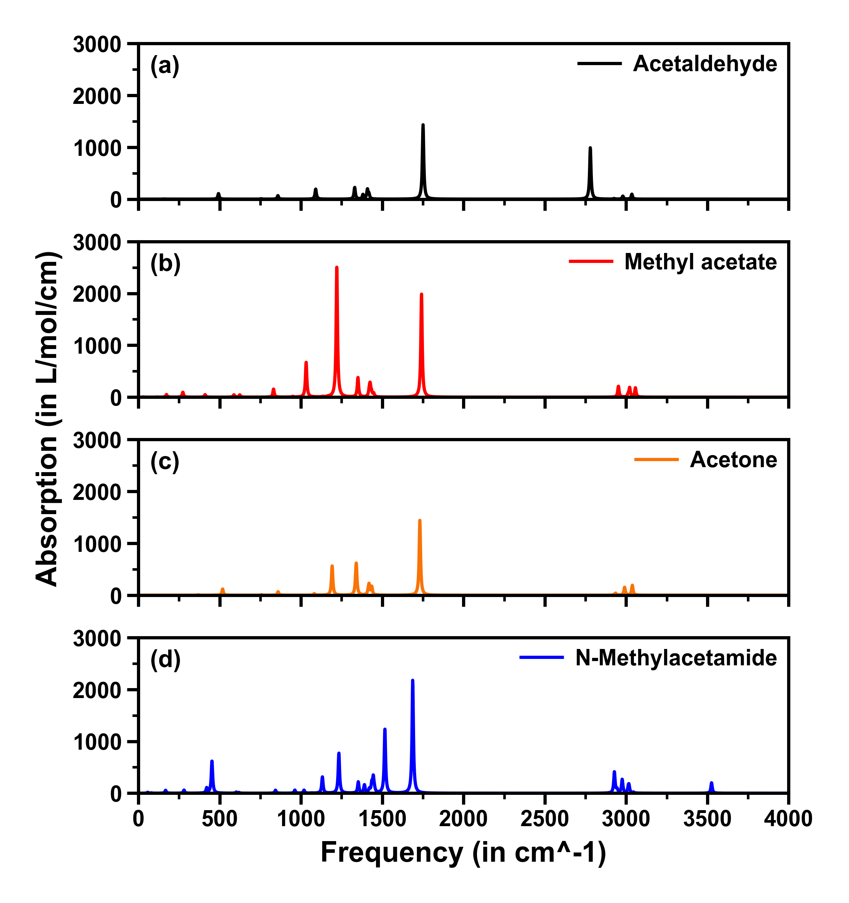
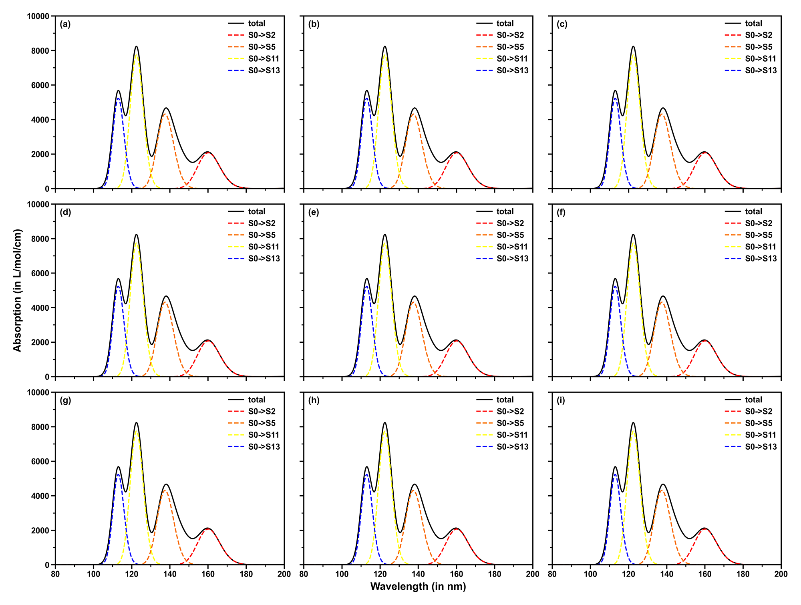

<h1 align="center">
    
</h1><br>


KimariDraw 是一款基于 Python 开发的开源绘图软件，专门用来处理著名的波函数分析程序 Multiwfn 绘制光谱所产生的数据，并重新绘制出美观、清晰的各种光谱图。对于科学研究人员和化学爱好者而言，KimariDraw 是一个非常实用的工具，它可以帮助用户更好地展示和分析波函数分析数据，有助于更好地理解和解释分析结果。

Multiwfn 是一个非常强大的波函数分析程序。Multiwfn 免费、开源、高效、灵活，它支持几乎所有最重要的波函数分析方法。Multiwfn 已经成为了量子化学领域的常用工具之一，目前得到了广泛的应用和认可。

**如果您对 Multiwfn 还不熟悉，请访问 [Multiwfn 官网](http://sobereva.com/multiwfn/)了解更多信息。**

当你使用 KimariDraw 时，你可以享受到以下的功能：

- **支持多种光谱类型**：KimariDraw 目前支持使用 Multiwfn 绘制 NMR、IR 等光谱导出的曲线数据，即 Multiwfn 生成的文本文件，也支持 Excel 文件（必须安装约定进行配置）。

- **美观的图形界面**：KimariDraw 的图形用户界面易于使用，您可以轻松地调整图表的大小、颜色等，以便更好地呈现您的数据。

- **支持多种文件格式**：KimariDraw 支持导入多种数据文件格式，包括文本文件和 Excel 文件。除此之外，KimariDraw 也支持将图表导出为多种文件格式，如 PNG、JPG、PDF 等。

- **易于安装和配置**：KimariDraw 的安装和配置十分简单，您只需要按照项目 README 文件中的说明进行操作即可。

## 安装

本项目已经开源在 Github 上，您可以通过以下步骤安装 KimariDraw：

1. 首先，您需要确保已经安装了 Python 环境和 pip 包管理工具。如果您还没有安装它们，请先安装它们。

2. 下载 KimariDraw 源代码：

```shell
git clone https://github.com/kimariyb/kimariDraw.git
```

3. 进入 KimariDraw 目录并安装依赖：

```shell
cd kimariDraw
pip install -r requirements.txt
```
这将自动安装 KimariDraw 所需的 numpy、matplotlib 和 scipy 等依赖项。请注意，如果您已经安装了这些依赖项，则可以跳过此步骤。

## 使用

在使用 KimariDraw 之前，必须使用 Multiwfn 自行根据量子化学计算程序生产的各种光谱计算产生的 `.out` 文件得到光谱的数据。如果不了解如何使用 Multiwfn 绘制各类光谱，可以浏览 Sob 的 [使用Multiwfn绘制红外、拉曼、UV-Vis、ECD、VCD和ROA光谱图](http://sobereva.com/224)。

要使用 KimariDraw，请执行以下步骤：

**请注意：在正式运行前，请确保已经安装了 Python 和 pip 包管理工具，以免程序报错！**

1. 在命令行中导航到 KimariDraw 目录。

2. 运行 kimaridraw.py 进入 KimariDraw 主程序：

```shell
KimariDraw --  A Python script that processes Multiwfn spectral data and plots various spectra.
Version: v2.4.0, release date: Aug-6-2023
Developer: Kimariyb, Ryan Hsiun
Address: XiaMen University, School of Electronic Science and Engineering
KimariDraw home website: https://github.com/kimariyb/kimariDraw
```

## 配置


## 绘制效果

### 绘制单子图

### 绘制多子图






## 使用脚本批量产生光谱数据

KimariDraw 程序中自带了一个用来批量产生 Multiwfn 光谱数据的脚本。如果想要批量产生绘制光谱的数据，可以在 `script` 文件夹中找到这个脚本。其中 `GenData.sh` 为 Linux 系统下的脚本，`GenData.bat` 为 Windows 系统下的脚本。

`GenData.sh` 以及 `GenData.bat` 都需要一个名为 `commands.txt` 的文件。`commands.txt` 文件包含了执行 Multiwfn 生成数据所需要的命令，如果想要使用这个脚本，则必须对 Multiwfn 有一定的了解。得到的数据可以使用 KimariDraw 继续绘制光谱，如下所示（可以使用图片编辑工具把 x 轴 y 轴标题删了）；也可以用 Origin 绘制你想要效果的光谱。


## 鸣谢

在开发 KimariDraw 时，主要使用了以下 Python 开源模组，在这里对开发这些模组的工作人员表示感谢。

- **matplotlib**
- **pandas**
- **proplot**
- **toml**


## 许可证

KimariDraw 基于 MIT 许可证开源。这意味着您可以自由地使用、修改和分发代码。有关更多信息，请参见 LICENSE 文件。


